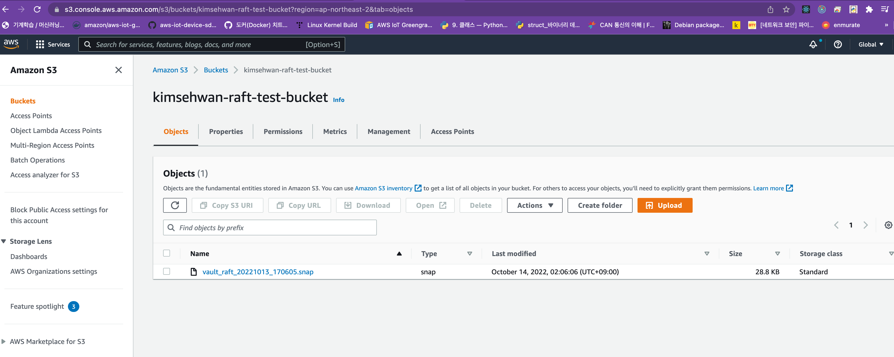

# K8s에 설치된 Vault 의 Raft 스토리지 스냅샷을 S3에 주기적으로 백업하는 K8s Cronjob 예시

## Minikube 에서의 예제 사용 방법

`vault-cronjob.yaml` 에서 `PUT_YOUR_BUCKET_NAME`을 여러분이 원하는 버킷명으로 변경해주세요. AWS S3 버킷명은 글로벌하게 unique 합니다. 지금은 S3 Bucket을 생성한 상태는 아니지만 괜찮습니다.

예시로 `raft-snapshot-foo-bar-baz-bucket` 등과 같이 지어주세요.

```yaml
            - name: upload
              image: amazon/aws-cli:2.2.14
              imagePullPolicy: IfNotPresent
              command:
                - /bin/sh
              args: # s3://PUT_YOUR_BUCKET_NAME should be matched with bucket name that you created from create-aws-resources.sh
                - -ec
                - |
                  until [ -f /share/vault-raft.snap ]; do sleep 5; done;
                  aws s3 cp /share/vault-raft.snap s3://PUT_YOUR_BUCKET_NAME/vault_raft_$(date +"%Y%m%d_%H%M%S").snap;
```

minikube 를 이용해 테스트합니다. 여러분이 vault를 이미 생성하고, 초기화, 봉인해제 했다면 건너뛰셔도 좋습니다.

```bash
$ minikube start
$ kubectl kustomize --enable-helm . | kubectl apply -f -
```

vault 파드가 모두 생성됨을 확인하세요

```console
kubectl get pods -n vault 
NAME                READY   STATUS      RESTARTS   AGE
vault-0             0/1     Running     0          57s
vault-1             0/1     Pending     0          57s
vault-2             0/1     Pending     0          57s
vault-server-test   0/1     Completed   0          57s
```

이후 Vault의 초기화를 위해 `init.sh`을 실행하세요. 만약 여러분이 Vault 를 이미 설치하시고 초기화, 봉인해제 과정을 거쳤다면 이 스크립트는 사용하지 않아도 됩니다.

```bash
$ ./init.sh
```

아래와 비슷한 출력이 나옵니다.

```console
$ ./init.sh                                                                                                                               01:32:09
Key                Value
---                -----
Seal Type          shamir
Initialized        true
Sealed             true
Total Shares       5
Threshold          3
Unseal Progress    1/3
Storage Type       raft
HA Enabled         true
Key                Value
.................................................
Key                     Value
---                     -----
Seal Type               shamir
Initialized             true
Sealed                  false
Total Shares            5
Threshold               3
HA Enabled              true
HA Cluster              https://vault-0.vault-internal:8201
HA Mode                 active
Active Since            2022-10-13T16:36:45.155820503Z
Raft Committed Index    36
Raft Applied Index      36
Error from server (BadRequest): pod vault-1 does not have a host assigned
Error from server (BadRequest): pod vault-2 does not have a host assigned
secret/vault-secret created
Success! Enabled the kv-v2 secrets engine at: secret/
```

Snapshot을 주기적으로 저장할 Cronjob에 필요한 인증을 활성화 하기 위해 `snapshot-prepare.sh`을 실행하세요.

```bash
$ ./snapshot-prepare.sh
```

출력은 아래와 비슷하게 나옵니다.

```console
$ ./snapshot-prepare.sh                                                                                                               10s 01:36:45
Success! Enabled approle auth method at: approle/
Success! Uploaded policy: snapshot
Success! Data written to: auth/approle/role/snapshot-agent
secret/vault-snapshot-agent-token created
```
위 스크립트는 아래와 같이 구현되어있습니다.

```bash
#!/usr/bin/env bash
export NAMESPACE=vault

kubectl exec -n $NAMESPACE vault-0 -- vault auth enable approle

kubectl exec -n $NAMESPACE -i vault-0 -- vault policy write snapshot - << EOF
path "sys/storage/raft/snapshot" {
   capabilities = ["read"]
}
EOF

kubectl exec -n $NAMESPACE vault-0 -- vault write auth/approle/role/snapshot-agent token_ttl=2h token_policies=snapshot

VAULT_APPROLE_ROLE_ID=$(kubectl exec -n $NAMESPACE vault-0 -- vault read auth/approle/role/snapshot-agent/role-id -format=json | jq -r .data.role_id)
VAULT_APPROLE_SECRET_ID=$(kubectl exec -n $NAMESPACE vault-0 -- vault write -f auth/approle/role/snapshot-agent/secret-id -format=json | jq -r .data.secret_id)

kubectl create secret generic vault-snapshot-agent-token -n vault --from-literal=VAULT_APPROLE_ROLE_ID=$VAULT_APPROLE_ROLE_ID --from-literal=VAULT_APPROLE_SECRET_ID=$VAULT_APPROLE_SECRET_ID 
```

vault의 인증 방식 중 approle 을 활성화 합니다. approle 은 인증을 받고싶어하는 Object가 RoleID 및 SecretID를 소유하고, 이것을 vault에 넘겨주면 vault는 임시 토큰을 넘겨줍니다. 이 토큰을 가지고 vault 에 API Call을 하게 되는 구조입니다.

approle의 role 이름은 `snapshot-agent`로 지었습니다. 이 정보를 vault 네임스페이스 내 k8s secret으로 저장합니다. 이 secret은 cronjob에서 사용할 예정입니다.

이후 `create-aws-resources.sh` 스크립트의 아래 부분을 여러분의 상황에 맞게 변경해주세요.

```yaml
export NAMESPACE=vault
export BUCKET_NAME=raft-snapshot-foo-bar-baz-bucket # Replace here with what you want to use for your bucket name
export REGION=ap-northeast-2
export AWS_PROFILE_NAME=YOUR_PROFILE_NAME # Replace here with your AWS_PROFILE_NAME here
```

```bash
$ ./create-aws-resource.sh
```


## Cronjob 수동 트리거

```bash
$ kubectl create job --from=cronjob/vault-snapshot-cronjob vault-snapshot-cronjob-manual-001 -n vault
```

이후 S3 버킷을 들어가서 snapshot이 잘 들어갔는지 확인해주세요.



위와 같이 저장되었다면 성공입니다.

## 생성한 리소스 삭제

```bash
$ ./delete-resource.sh
```

위 스크립트를 이용해 AWS S3 Bucket, IAM Policy, IAM User 등을 삭제하시면 됩니다. 별도로 삭제하셔도 됩니다.
